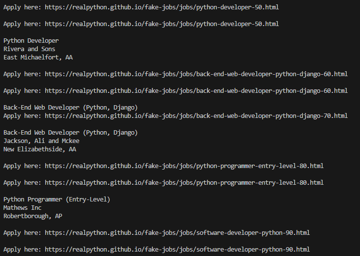
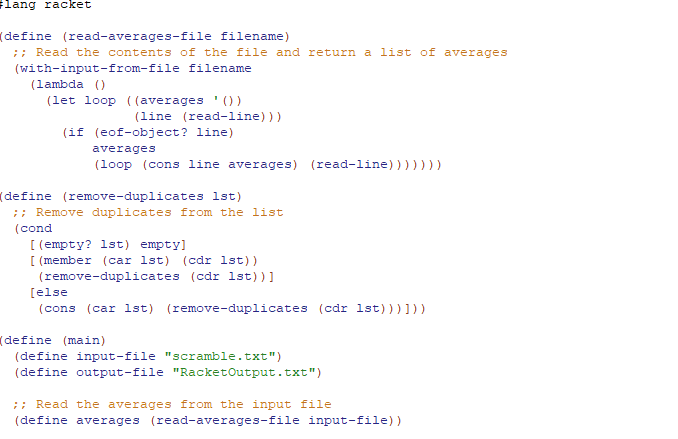

Portfolio
=========

Programming Projects
--------------------

*For access to my private project repositories, please [email me](mailto:NADavidson@csustudent.net?subject=GitHub%20Access) with the subject line, GitHub Access.

---
### [Web Scraping With Python | CSCI 301](project1)

---
### [Racket Organizing | CSCI 301](RacketReadMe.md)

---

Ethics Papers
-------------

### [Ethics and Copyright](/pdf/Ethics_and_Copyright.pdf)

-   **Class:Survey of Scripting Languages**  
-   **Grade: 90**

---

Reflection Questions
-------------

1. One challenge I have overcome in my academic development was a struggle with Java. I found it difficult at first, and felt down about not getting it at first. I realized that this language was a little intimidating and unlike others I had encountered leading up to the course. After studying and asking for help, I finally understood the language and was able to grasp the concepts. 

2. I worked with a team to develop a web app, including the front end, back end, and the database. I noticed that I could improve my skills regarding databases, so I started doing projects on the side to help me learn. Areas that I can improve on working in a team environment would be being more embracing of ideas that put me out of my comfort zone and listening more.

3. I believe the CS career I am most suited for is a Web Developer, I am effecient at creating websites, including using frameworks and other helpful tools such as React, APIs, Tailwind, etc. I enjoy programming with languages like Python and C++, but I believe I succeed more in Web Development.

4. One  professional organization I would like to join is the Association for the Advancement of Artificial Intelligence. I enjoy researching the capabilities of AI, and learning the new ways that AI is helping the world grow and advance. AI won't be slowing down anytime soon, and I would like to be more involved in this area of Computing. 

5. I can use the skills I have learned to help my community understand the functions of technology, and the benefits that the ever advancing technological advancements can have on our world. It would be beneficial to attend conferences and bring more people to these conferences to help spread the word of how these advancements can be used to help people. One day I would like to use what I have learned and will learn to create technology that can help people that have chronic illness, and help find solutions to everyday problems. 

---

Page template forked from <a href="https://github.com/csu-cs/csci-portfolio">CSU-CS</a>

<!-- Remove above link if you don't want to attributive -->
