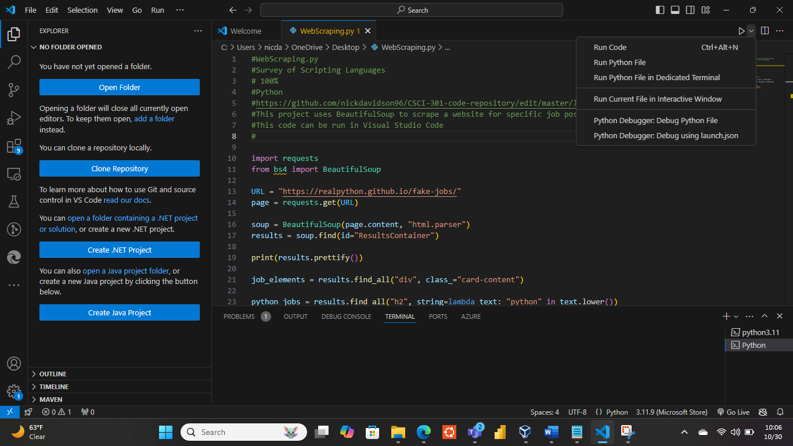
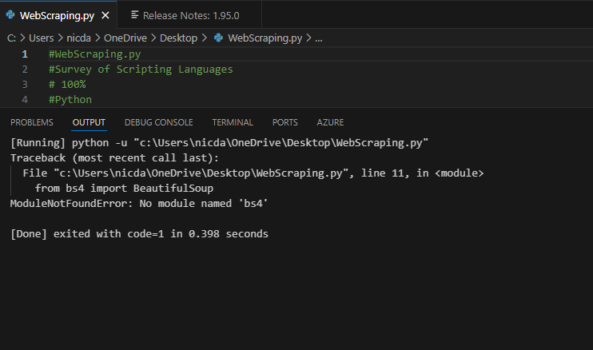

[Back to Portfolio](./)

WebScraping.py
===============

-   **Class: Survey of Scripting Languages** 
-   **Grade:90** 
-   **Language(s):Python** 
-   **Source Code Repository:** [lab08.py](https://github.com/nickdavidson96/CSCI-301-code-repository/edit/master/lab08/lab08.py)  
    (Please [email me](mailto:nadavidson@csustudent.net?subject=GitHub%20Access) to request access.)

## Project description

This program uses Python and within it, Beautiful Soup and Requests, to scrape the Github Job site for jobs that contain Python in them.

## How to run the program

How to run the program.

```bash
cd ./WebScraping.py
python WebScraping.py
```

Another way to run this program is through an IDE such as Visual Studio Code , given that you use pip to install bs4 from BeautifulSoup and install Python extension which allows for the interpreter to run.

## UI Design

The way to run the program below (see Fig 1), given that you have the Python extension installed in Visual Studio Code, you can press Run Python File, and the program will execute. When the Program is run, it should generate similar results (see Fig 2). If you do not have the proper libraries installed, an error will occur (see Fig 3).

  
Fig 1. The start screen from within Visual Studio Code 

  
Fig 2. Example output after input is processed.

  
Fig 3. Feedback when an error occurs.

## 3. Additional Considerations

You should ensure your computer or IDE has an interpreter installed/available to be able to run the program, as well as the proper libraries installed using pip.

For more details see [GitHub Flavored Markdown](https://guides.github.com/features/mastering-markdown/).

[Back to Portfolio](./)
