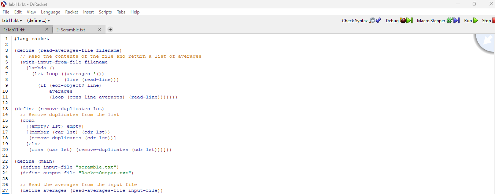
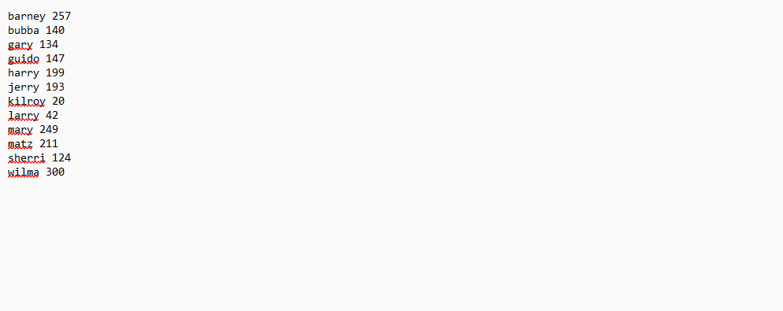
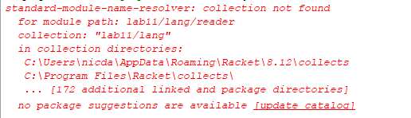

[Back to Portfolio](./)

Lab11.Rkt
===============

-   **Class: Survey of Scripting Languages** 
-   **Grade: 85** 
-   **Language(s): Racket** 
-   **Source Code Repository:** [lab11.rkt]([)
)  
    (Please [email me](mailto:nadavidson@csustudent.net?subject=GitHub%20Access) to request access.)

## Project description

This program uses Racket to organize a file and output the correct file.
## How to run the program

How to run the program.

To run this project, you can install Dr. Racket, and run from the Application interface.

Another way to run this program is through an IDE such as Visual Studio Code , given that you install Racket Repl.

## UI Design

The way to run the program below (see Fig 1) When the Program is run, it should generate similar results (see Fig 2). If you do not have the proper file location, an error will occur (see Fig 3).

  
Fig 1. The Dr Racket Application

  
Fig 2. Example output after input is processed.

  
Fig 3. Feedback when an error occurs.

## 3. Additional Considerations

You should ensure your computer has Dr Racket installed or the correct extensions installed within VS Code to run the program, as well as the correct file location.
For more details see [Racket Read Me](RacketREADME.md).

[Back to Portfolio](./)
